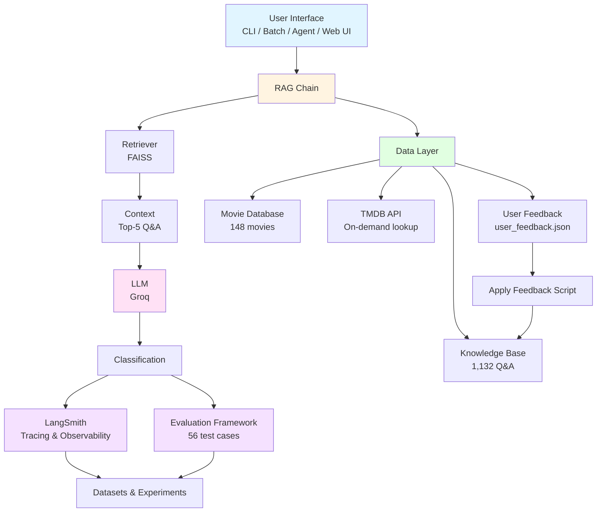
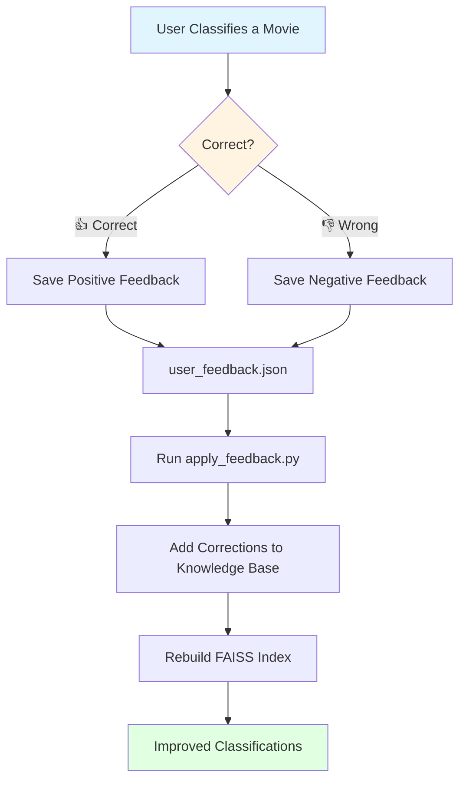
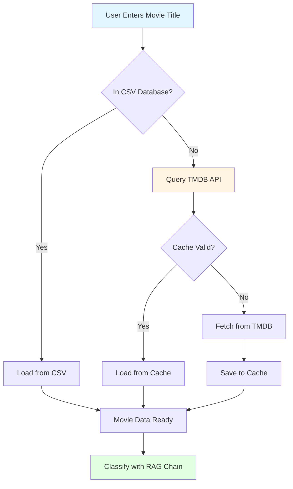
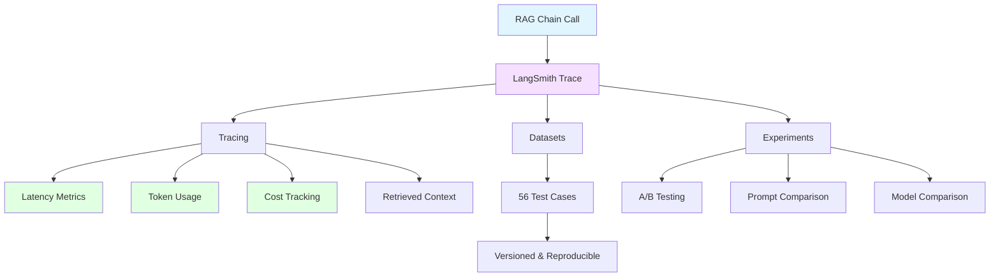

# 🎬 Movie Content Safety Classifier

> AI-powered system that determines if a movie is appropriate for children aged 5-10

Built with **LangChain**, **FAISS**, and **Groq** — a complete RAG system with an AI Agent for complex queries.

---

## ✨ Features

Feature

Description

**RAG Classification**

Semantic search to retrieve relevant safety rules

**AI Agent**

Answers complex questions using 3 tools

**Interactive CLI**

Chat-style interface for movie safety queries

**Batch Processing**

Classify multiple movies at once

**Web Interface**

Gradio-based UI with tabs for classification, agent, and batch

**Evaluation Framework**

56 test cases with accuracy metrics

**User Feedback Loop**

Collects user corrections to improve over time

**TMDB API Integration**

Fetches real movie data from The Movie Database

**LangSmith Observability**

Full tracing, datasets, and experiments

**Movie Database**

148+ movies with details

**Knowledge Base**

1,132 safety Q&A pairs

---

## 🏗️ Architecture



**Flow:** Query → Embedding → FAISS Search → Top-5 Q&A → LLM → Classification

**Feedback Loop:** Script → Knowledge Base → FAISS Rebuild → Improved Classifications

**Data Sources:** Knowledge Base (static) + Movie Database (CSV) + TMDB API (on-demand)

---

## 🚀 Quick Start

### Prerequisites

-   Python 3.10+
-   Groq API key (free) — [Get it here](https://console.groq.com)

## Setup

````bash
git clone https://github.com/flaviocr2012/movie-content-safety.git
cd movie-content-safety
python3 -m venv venv
source venv/bin/activate
pip install -r requirements.txt


### Configure

Create a `.env` file in the project root:

```bash
GROQ_API_KEY=your_api_key_here
GROQ_MODEL=openai/gpt-oss-20b

# TMDB (Movie Data)
TMDB_API_KEY=your_tmdb_api_key_here

# LangSmith (Observability)
LANGCHAIN_TRACING_V2=true
LANGCHAIN_ENDPOINT=https://api.smith.langchain.com
LANGCHAIN_API_KEY=your_langsmith_api_key_here
LANGCHAIN_PROJECT=movie-content-safety

````

> **Note:** Get your free API keys from:

| Service | Purpose | Link |
|---------|---------|------|
| **Groq** | LLM inference | [console.groq.com](https://console.groq.com) |
| **TMDB** | Movie data | [themoviedb.org](https://www.themoviedb.org/settings/api) |
| **LangSmith** | Observability | [smith.langchain.com](https://smith.langchain.com) |

## 🚀 Run

### 1. Generate the Data

```bash
# Generate the movies database (148 movies)
python scripts/generate_movies.py

# Generate the knowledge base (1,132 Q&A pairs)
python scripts/generate_knowledge_base.py

# Validate the knowledge base
python scripts/validate_knowledge_base.py

# (Optional) Load movies from TMDB API instead
python scripts/load_from_tmdb.py
```

### 2. Build the Vector Index

```bash
python src/vector_store.py
```

### 3. Interactive Movie Classifier

```bash
python src/main.py
```

**Example Interaction:**

```
🎬 Enter movie title (or command): The Lion King
📖 Found 'The Lion King' in CSV database!
📝 Year: 1994 | Rating: 8.5 | Genres: Animation, Adventure, Drama

📌 Result:
Classification: Safe for children
Explanation: The movie is animated, family-friendly, and contains no adult content.
```

### 4. Batch Classification

```bash
python src/main.py --batch --limit 5
```

### 5. AI Agent for Complex Queries

```bash
python src/agent.py
```

**Example Questions:**

-   *"Can you find me a movie like The Lion King that is appropriate for a 5-year-old?"*
-   *"Is Jurassic Park safe for children?"*
-   *"What are the best family movies in the database?"*

### 6. Web Interface (Gradio)

```bash
python src/app.py
```

This launches a web UI with:

```
🔍 Classify a Movie — Enter any movie and get a classification

🤖 AI Agent — Ask complex questions

📊 Batch Classification — Classify multiple movies at once

ℹ️ About — Project details
```

### 7. Run Evaluations

```bash
python src/evals.py
```

# 📊 EVALUATION SUMMARY

📈 Overall Accuracy: 100.0% ✅ Passed: 55/55 ❌ Failed: 0/55

🎯 Safe Movies: 100.0% accuracy ✅ 30/30

# 🎯 Not Safe Movies: 100.0% accuracy ✅ 25/25

### 8. User Feedback Loop

```bash
# View feedback report
python -m src.feedback

# Apply feedback corrections to the knowledge base
python scripts/apply_feedback.py
```

### 9. LangSmith Experiments

```bash
# Create the LangSmith dataset (run once)
python scripts/create_langsmith_dataset.py

# Run an experiment to evaluate the RAG chain
python scripts/run_langsmith_experiment.py
```

🧪 RUNNING LANGSMITH EXPERIMENT ✅ RAG Chain initialized successfully! 🧪 Running experiment against 'movie-safety-eval' dataset... ✅ Experiment complete! 🔗 View results at: [https://smith.langchain.com/projects/movie-content-safety](https://smith.langchain.com/projects/movie-content-safety)

## 📊 Sample Outputs

### Agent Response


💭 Your question: What movies are safe for children?

📌 Response:
Here are some movies that are safe for children aged 5-10:

| Movie | Rating | Why it's safe |
|-------|--------|---------------|
| Toy Story | G | Animated, no violence, positive messages |
| Finding Nemo | G | Light-hearted adventure, no scary content |
| Frozen | PG | Positive themes of sisterhood and self-acceptance |
| The Lion King | G | Strong moral lessons, no graphic violence |
```

### Movie Classification


🎬 Enter movie title (or command): The Conjuring
📖 Found 'The Conjuring' in CSV database!
📝 Year: 2013 | Rating: 7.5 | Genres: Horror, Mystery, Thriller

📌 Result:
Classification: Not safe for children
Explanation: The Conjuring is a horror film with a rating of 7.5 (R). It contains supernatural terror, frightening imagery, and intense suspense typical of the horror genre, making it unsuitable for children aged 5-10.
```

### TMDB Lookup (On-Demand)

```
🎬 Enter movie title (or command): Mission Impossible
⚠️ 'Mission Impossible' not found in CSV database.
🌐 Looking up on TMDB...
✅ Found on TMDB: Mission: Impossible (1996)
📝 Genres: Adventure, Action, Thriller | Rating: 7.0

📌 Result:
Classification: Not safe for children
Explanation: The movie contains intense action sequences and is rated PG-13...
```

## 📁 Project Structure

```
movie-content-safety/
├── .env                            # Environment variables (not committed)
├── .gitignore                      # Git ignore rules
├── requirements.txt                # Python dependencies
├── README.md                       # This file
├── data/
│   ├── knowledge_base.csv          # 1,132 Q&A safety rules
│   ├── imdb_movies.csv             # 148 movies with details
│   ├── user_feedback.json          # User feedback entries
│   ├── tmdb_cache.json             # TMDB API cache
│   ├── evaluation_report.txt       # Human-readable report
│   ├── evaluation_results.csv      # Eval results (CSV)
│   ├── evaluation_results.json     # Eval results (JSON)
│   └── faiss_index/                # FAISS vector index
│       ├── index.faiss
│       └── index.pkl
├── scripts/
│   ├── generate_movies.py          # Generate movie database
│   ├── generate_knowledge_base.py  # Generate knowledge base
│   ├── validate_knowledge_base.py  # Validate CSV integrity
│   ├── apply_feedback.py           # Apply feedback to KB
│   ├── load_from_tmdb.py           # Load movies from TMDB
│   ├── create_langsmith_dataset.py # Create LangSmith dataset
│   └── run_langsmith_experiment.py # Run LangSmith experiment
└── src/
    ├── config.py                   # Configuration & API keys
    ├── vector_store.py             # Build FAISS index
    ├── rag_chain.py                # RAG pipeline with Groq
    ├── main.py                     # Interactive CLI + Batch
    ├── agent.py                    # AI Agent for complex queries
    ├── app.py                      # Gradio web interface
    ├── evals.py                    # Evaluation framework
    ├── feedback.py                 # User feedback manager
    ├── tmdb_client.py              # TMDB API client
    └── document_loader.py          # Document loading utilities
```

## 🛠️ Tech Stack

Technology

Purpose

**LangChain**

LLM orchestration framework

**FAISS**

Vector similarity search

**Groq**

Fast, free LLM inference

**HuggingFace**

Embedding models (all-MiniLM-L6-v2)

**Python**

Core programming language

**Pandas**

CSV data handling

**Gradio**

Web Interface

**TMDB API**

Movie Data Source

**Lang Smith**

LLM observability and evaluation

## 📦 Dependencies

```txt
langchain>=0.3.0
langchain-community>=0.3.0
langchain-core>=0.3.0
langchain-groq>=0.1.0
langchain-huggingface
faiss-cpu
sentence-transformers
pandas
python-dotenv
gradio>=4.0.0
requests>=2.31.0
```

## 📊 Evaluation Framework

The project includes a comprehensive evaluation framework with **56 test cases** (31 Safe + 25 Not Safe movies).

### Metrics

Metric

Description

**Overall Accuracy**

% of correct classifications

**Safe Accuracy**

% of Safe movies correctly classified

**Not Safe Accuracy**

% of Not Safe movies correctly classified

**Failed Cases**

List of misclassified movies

### Results

-   **Total Tests:** 56
-   **Passed:** 56 ✅
-   **Failed:** 0 ❌
-   **Overall Accuracy:** 100%
-   **Safe Accuracy:** 100%
-   **Not Safe Accuracy:** 100%

### Exported Files

-   `data/evaluation_results.json` — Full results in JSON
-   `data/evaluation_results.csv` — Results in CSV for Excel
-   `data/evaluation_report.txt` — Human-readable report

## 🔄 User Feedback Loop

The system collects user feedback to continuously improve accuracy.



## 🌐 TMDB API Integration

The system integrates with **The Movie Database (TMDB)** for on-demand movie lookups.



### Features

-   **On-Demand Lookup:** If a movie isn't in the CSV, it's fetched from TMDB
-   **Caching:** API responses are cached locally to reduce API calls
-   **Rate Limiting:** Respects TMDB rate limits (40 requests per 10 seconds)

### Endpoints Used

| Endpoint | Purpose |
|----------|---------|
| `/movie/popular` | Fetch popular movies |
| `/movie/top_rated` | Fetch top-rated movies |
| `/discover/movie` | Fetch family-friendly movies |
| `/search/movie` | Search for a specific movie |

Search for a specific movie

## 📊 LangSmith Observability

The project uses **LangSmith** for full LLM observability.



### Tracked Features

| Feature / Component | Purpose |
|---------------------|---------|
| **LLM Tracing** | Track execution steps, prompts, and completions for AI-powered movie queries |
| **Evaluation Datasets** | Benchmark recommendation accuracy and relevance against golden datasets |
| **Prompt Playground** | Experiment, iterate, and optimize system prompts before pushing to production |

### Dashboard Metrics

| Metric | Description |
|--------|-------------|
| **Latency** | Measures the end-to-end response time for AI recommendation calls |
| **Token Count** | Tracks prompt and completion token consumption for cost management |
| **Error Rate** | Monitors failed LLM calls, output parsing errors, and API timeouts |
| **Feedback Score** | Aggregates user feedback ratings (thumbs up/down) on generated recommendations |

## 🔮 Next Steps

-    Deploy to production
-    Add more test cases for edge cases

## 📫 Let's Connect!

If you found this project interesting, feel free to reach out!

[](https://www.linkedin.com/in/flavio-rodrigues-7563b631/) [](https://github.com/flaviocr2012)

---