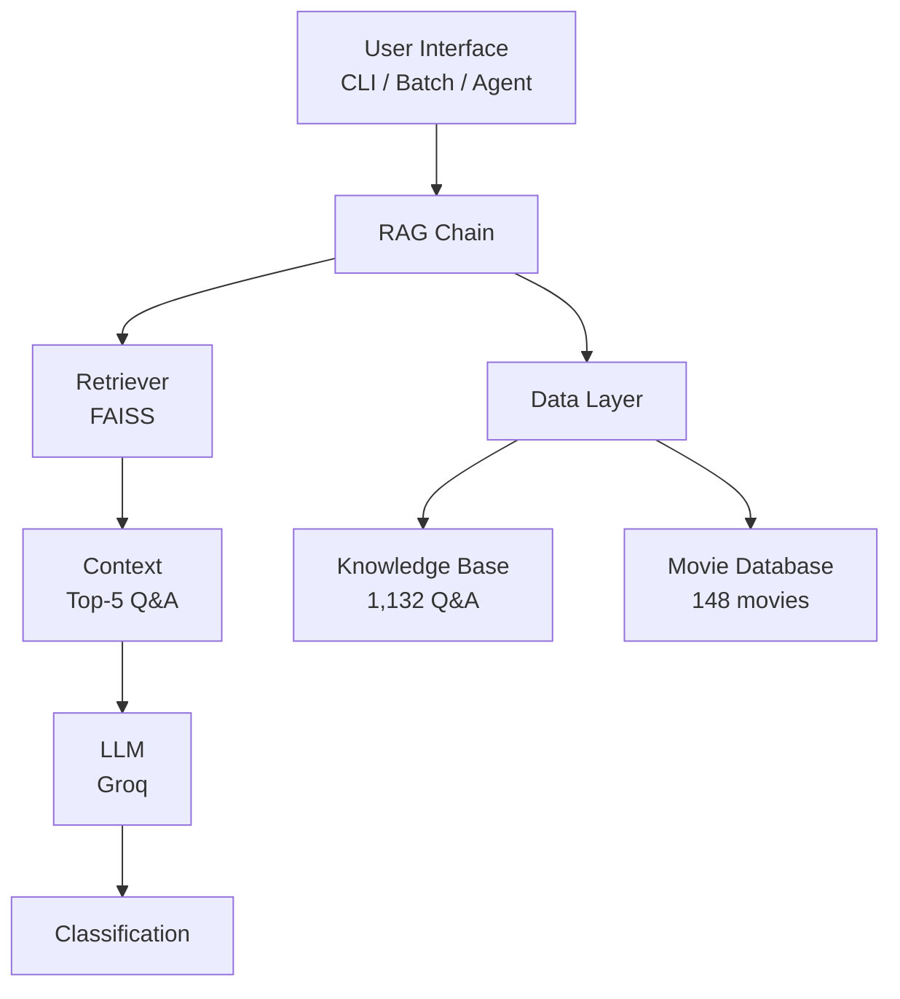

# 🎬 Movie Content Safety Classifier

> AI-powered system that determines if a movie is appropriate for children aged 5-10

Built with **LangChain**, **FAISS**, and **Groq** — a complete RAG system with an AI Agent for complex queries.

---

## ✨ Features

| Feature | Description |
|---------|-------------|
| **RAG Classification** | Semantic search to retrieve relevant safety rules |
| **AI Agent** | Answers complex questions using 3 tools |
| **Interactive CLI** | Chat-style interface for movie safety queries |
| **Batch Processing** | Classify multiple movies at once |
| **Web Interface** | Gradio-based UI with tabs for classification, agent, and batch |
| **Evaluation Framework** | 55 test cases with accuracy metrics |
| **Movie Database** | 148 movies with details |
| **Knowledge Base** | 1,132 safety Q&A pairs |

---

## 🏗️ Architecture



**Flow:** Query → Embedding → FAISS Search → Top-5 Q&A → LLM → Classification

---

## 🚀 Quick Start

### Prerequisites

- Python 3.10+
- Groq API key (free) — [Get it here](https://console.groq.com)

## Setup

```bash
git clone https://github.com/flaviocr2012/movie-content-safety.git
cd movie-content-safety
python3 -m venv venv
source venv/bin/activate
pip install -r requirements.txt


### Configure

Create a `.env` file in the project root:

```bash
GROQ_API_KEY=your_api_key_here
GROQ_MODEL=openai/gpt-oss-20b
```

> **Note:** Get your free Groq API key from [console.groq.com](https://console.groq.com)

## 🚀 Run

### 1. Build the Vector Index

```bash
python src/vector_store.py
```

### 2. Interactive Movie Classifier

```bash
python src/main.py
```

**Example Interaction:**

```
🎬 Enter movie title (or command): The Lion King
📖 Found 'The Lion King' in CSV database!
📝 Year: 1994 | Rating: 8.5 | Genres: Animation, Adventure, Drama

📌 Result:
Classification: Safe for children
Explanation: The movie is animated, family-friendly, and contains no adult content.
```

### 3. Batch Classification

```bash
python src/main.py --batch --limit 5
```

### 4. AI Agent for Complex Queries

```bash
python src/agent.py
```

**Example Questions:**

- *"Can you find me a movie like The Lion King that is appropriate for a 5-year-old?"*
- *"Is Jurassic Park safe for children?"*
- *"What are the best family movies in the database?"*

## 📊 Sample Outputs

### Agent Response

```
💭 Your question: What movies are safe for children?

📌 Response:
Here are some movies that are safe for children aged 5-10:

| Movie | Rating | Why it's safe |
|-------|--------|---------------|
| Toy Story | G | Animated, no violence, positive messages |
| Finding Nemo | G | Light-hearted adventure, no scary content |
| Frozen | PG | Positive themes of sisterhood and self-acceptance |
| The Lion King | G | Strong moral lessons, no graphic violence |
```

### Movie Classification

```
🎬 Enter movie title (or command): The Conjuring
📖 Found 'The Conjuring' in CSV database!
📝 Year: 2013 | Rating: 7.5 | Genres: Horror, Mystery, Thriller

📌 Result:
Classification: Not safe for children
Explanation: The Conjuring is a horror film with a rating of 7.5 (R). It contains supernatural terror, frightening imagery, and intense suspense typical of the horror genre, making it unsuitable for children aged 5-10.
``` 

### Web Interface (Gradio)

```
python src/app.py
```

    🔍 Classify a Movie — Enter any movie and get a classification

    🤖 AI Agent — Ask complex questions

    📊 Batch Classification — Classify multiple movies at once

    ℹ️ About — Project details

### Run Evaluations

```
python src/evals.py
```

📊 EVALUATION SUMMARY
============================================================
📈 Overall Accuracy: 100.0%
✅ Passed: 55/55
❌ Failed: 0/55

🎯 Safe Movies: 100.0% accuracy
✅ 30/30

🎯 Not Safe Movies: 100.0% accuracy
✅ 25/25
============================================================

## 📁 Project Structure

```
movie-content-safety/
├── .env                            # Environment variables
├── .gitignore                      # Git ignore rules
├── requirements.txt                # Python dependencies
├── movie-content-safety.iml        # IntelliJ module file
├── README.md                       # This file
├── data/
│   ├── knowledge_base.csv          # 1,132 Q&A safety rules
│   ├── imdb_movies.csv             # 148 movies with details
│   ├── evaluation_report.txt       # Human-readable report
│   ├── evaluation_results.csv      # Eval results (CSV)
│   ├── evaluation_results.json     # Eval results (JSON)
│   └── faiss_index/                # FAISS vector index
│       ├── index.faiss
│       └── index.pkl
├── scripts/
│   ├── generate_movies.py          # Generate movie database
│   ├── generate_knowledge_base.py  # Generate knowledge base
│   └── validate_knowledge_base.py  # Validate CSV integrity
└── src/
    ├── config.py                   # Configuration & API keys
    ├── vector_store.py             # Build FAISS index
    ├── rag_chain.py                # RAG pipeline with Groq
    ├── main.py                     # Interactive CLI + Batch
    ├── agent.py                    # AI Agent for complex queries
    ├── app.py                      # Gradio web interface
    ├── evals.py                    # Evaluation framework
    └── document_loader.py          # Document loading utilities
``` 

## 🛠️ Tech Stack

| Technology      | Purpose                             |
|-----------------|-------------------------------------|
| **LangChain**   | LLM orchestration framework         |
| **FAISS**       | Vector similarity search            |
| **Groq**        | Fast, free LLM inference            |
| **HuggingFace** | Embedding models (all-MiniLM-L6-v2) |
| **Python**      | Core programming language           |
| **Pandas**      | CSV data handling                   |  
| **Gradio**      | Web Interface                       |  

## 📦 Dependencies

```txt
langchain>=0.3.0
langchain-community>=0.3.0
langchain-core>=0.3.0
langchain-groq>=0.1.0
langchain-huggingface
faiss-cpu
sentence-transformers
pandas
python-dotenv
gradio>=4.0.0
``` 

## 🔮 Next Steps

- [ ] Deploy to production
- [ ] Add more test cases for edge cases

## 📫 Let's Connect!

If you found this project interesting, feel free to reach out!

[](https://www.linkedin.com/in/flavio-rodrigues-7563b631/)
[](https://github.com/flaviocr2012)

---
