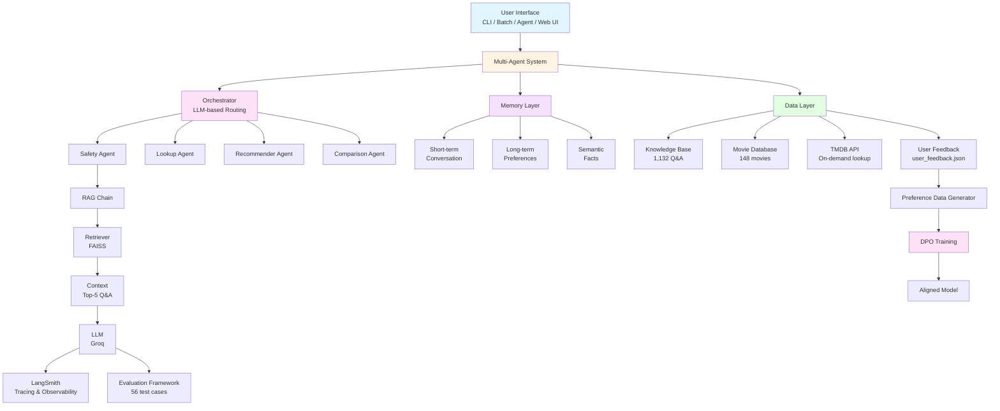
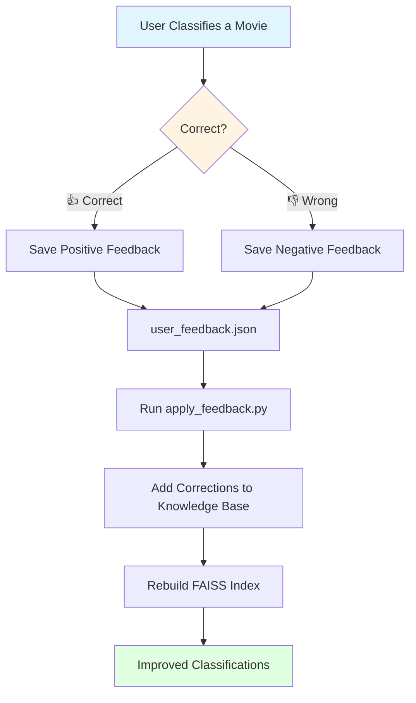
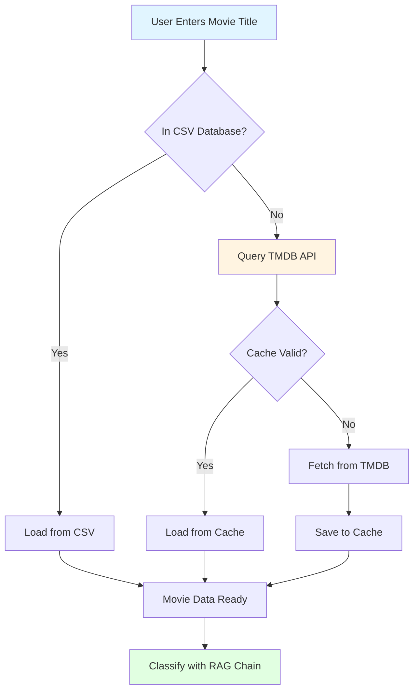
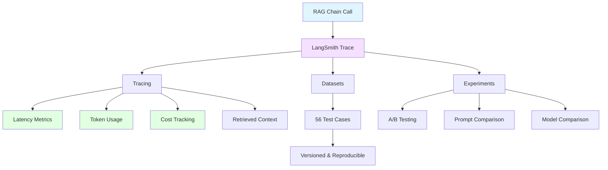
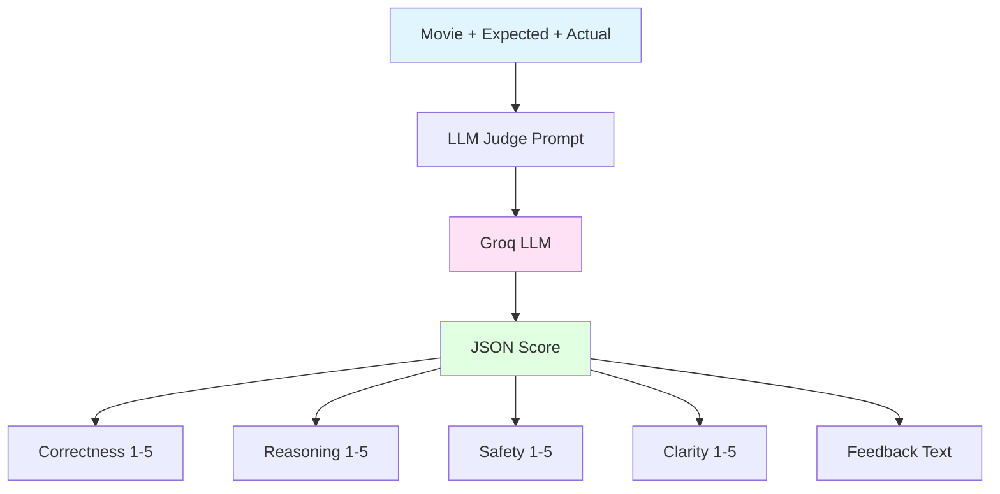

# 🎬 Movie Content Safety Classifier

[](https://flaviocr2012-movie-content-safety-streamlit-app-p9mrc2.streamlit.app)
[](https://huggingface.co/flaviocr2023/movie-safety-llama-3.1-8b)
[](https://www.kaggle.com/datasets/flaviocr2012/movie-safety-lora-adapter)
[](https://github.com/flaviocr2012/movie-content-safety)
[](https://www.linkedin.com/in/flavio-rodrigues-7563b631/)

> **🚀 [Try the live app →](https://flaviocr2012-movie-content-safety-streamlit-app-p9mrc2.streamlit.app)**

> AI-powered system that determines if a movie is appropriate for children aged 5-10

---

## 🏆 Project Highlights

- **End-to-end AI system** — from RAG classification to multi-agent orchestration
- **Fine-tuned model deployed** — Llama 3.1 8B with LoRA + DPO, live on [Hugging Face Hub](https://huggingface.co/flaviocr2023/movie-safety-llama-3.1-8b)
- **100% accuracy** on a 56-case evaluation suite
- **Full observability** — LangSmith tracing, LLM-as-judge, user feedback loop
- **Production-deployed** — app with 1,132 Q&A knowledge base

---

## ✨ Features

| Feature | Description |
|---------|-------------|
| **RAG Classification** | Semantic search to retrieve relevant safety rules |
| **AI Agent** | Answers complex questions using 4 tools |
| **Multi-Agent System** | 4 specialized agents (Safety, Lookup, Recommender, Comparison) with LLM-based orchestration |
| **Agent Memory** | Short-term, long-term, and semantic memory across conversations |
| **Interactive CLI** | Chat-style interface for movie safety queries |
| **Batch Processing** | Classify multiple movies at once |
| **Web Interface (Gradio)** | Gradio UI with 4 tabs — used for local development |
| **Web Interface (Streamlit, Deployed)** | Public app live on [Streamlit Cloud](https://flaviocr2012-movie-content-safety-streamlit-app-p9mrc2.streamlit.app) |
| **Fine-Tuned Model (Deployed)** | LoRA + DPO fine-tuned Llama 3.1 8B live on [Hugging Face Hub](https://huggingface.co/flaviocr2023/movie-safety-llama-3.1-8b) |
| **Evaluation Framework** | 56 test cases with accuracy metrics |
| **LLM-as-Judge** | Multi-dimension quality scoring using an LLM evaluator |
| **User Feedback Loop** | Collects user corrections to improve over time |
| **Preference Data Generator** | Converts feedback into DPO-ready training pairs |
| **LLM Fine-Tuning** | LoRA/QLoRA pipeline on Llama 3.1 8B with Unsloth |
| **DPO Training** | Direct Preference Optimization on user feedback data |
| **TMDB API Integration** | Fetches real movie data from The Movie Database |
| **LangSmith Observability** | Full tracing, datasets, and experiments |
| **Movie Database** | 148+ movies with details |
| **Knowledge Base** | 1,132 safety Q&A pairs |

---

## 🤗 Model on Hugging Face Hub

The fine-tuned **Llama 3.1 8B** model is deployed and publicly available:

> **🔗 [flaviocr2023/movie-safety-llama-3.1-8b](https://huggingface.co/flaviocr2023/movie-safety-llama-3.1-8b)**

Load it in one line:

```python
from transformers import AutoModelForCausalLM, AutoTokenizer

model = AutoModelForCausalLM.from_pretrained("flaviocr2023/movie-safety-llama-3.1-8b")
tokenizer = AutoTokenizer.from_pretrained("flaviocr2023/movie-safety-llama-3.1-8b")
```

| Artifact | Link | Purpose |
|---|---|---|
| **Merged model** | [Hugging Face Hub](https://huggingface.co/flaviocr2023/movie-safety-llama-3.1-8b) | Standalone, ready-to-use fine-tuned model |
| **LoRA adapter** | [Kaggle Dataset](https://www.kaggle.com/datasets/flaviocr2012/movie-safety-lora-adapter) | Adapter weights for re-merging or continued training |
| **Loading example** | [`models/load_finetuned.py`](models/load_finetuned.py) | Script to load and run inference from the Hub |

---

## 🏗️ Architecture


```mermaid
flowchart TD
    A[User Interface<br/>CLI / Batch / Agent / Web UI] --> B[Multi-Agent System]
    B --> C[Orchestrator<br/>LLM-based Routing]
    C --> D[Safety Agent]
    C --> E[Lookup Agent]
    C --> F[Recommender Agent]
    C --> G[Comparison Agent]

    D --> H[RAG Chain]
    H --> I[Retriever<br/>FAISS]
    I --> J[Context<br/>Top-5 Q&A]
    J --> K[LLM<br/>Groq]

    B --> L[Memory Layer]
    L --> M[Short-term<br/>Conversation]
    L --> N[Long-term<br/>Preferences]
    L --> O[Semantic<br/>Facts]

    B --> P[Data Layer]
    P --> Q[Knowledge Base<br/>1,132 Q&A]
    P --> R[Movie Database<br/>148 movies]
    P --> S[TMDB API<br/>On-demand lookup]
    P --> T[User Feedback<br/>user_feedback.json]

    K --> U[LangSmith<br/>Tracing & Observability]
    K --> V[Evaluation Framework<br/>56 test cases]

    T --> W[Preference Data Generator]
    W --> X[DPO Training]
    X --> Y[Aligned Model]

    style A fill:#e1f5ff
    style B fill:#fff4e1
    style C fill:#ffe1f5
    style L fill:#f5e1ff
    style P fill:#e1ffe1
    style X fill:#ffe1f5
```

**Flow:** Query → Embedding → FAISS Search → Top-5 Q&A → LLM → Classification

**Memory:** Short-term (conversation) + Long-term (preferences) + Semantic (facts)

**Fine-Tuning Pipeline:** Base Model → SFT → Feedback → Preference Data → DPO → Aligned Model

**Feedback Loop:** Script → Knowledge Base → FAISS Rebuild → Improved Classifications

**Data Sources:** Knowledge Base (static) + Movie Database (CSV) + TMDB API (on-demand)

---

## 🚀 Quick Start

### Prerequisites

-   Python 3.10+
-   Groq API key (free) — [Get it here](https://console.groq.com)

### Setup

```bash
git clone https://github.com/flaviocr2012/movie-content-safety.git
cd movie-content-safety
python3 -m venv venv
source venv/bin/activate
pip install -r requirements.txt
```

### Configure

Create a `.env` file in the project root:

```bash
GROQ_API_KEY=your_api_key_here
GROQ_MODEL=openai/gpt-oss-20b

# TMDB (Movie Data)
TMDB_API_KEY=your_tmdb_api_key_here

# LangSmith (Observability)
LANGCHAIN_TRACING_V2=true
LANGCHAIN_ENDPOINT=https://api.smith.langchain.com
LANGCHAIN_API_KEY=your_langsmith_api_key_here
LANGCHAIN_PROJECT=movie-content-safety
```

> **Note:** Get your free API keys from:

| Service | Purpose | Link |
|---------|---------|------|
| **Groq** | LLM inference | [console.groq.com](https://console.groq.com) |
| **TMDB** | Movie data | [themoviedb.org](https://www.themoviedb.org/settings/api) |
| **LangSmith** | Observability | [smith.langchain.com](https://smith.langchain.com) |

## 🚀 Run

### 1. Generate the Data

```bash
# Generate the movies database (148 movies)
python scripts/generate_movies.py

# Generate the knowledge base (1,132 Q&A pairs)
python scripts/generate_knowledge_base.py

# Validate the knowledge base
python scripts/validate_knowledge_base.py

# (Optional) Load movies from TMDB API instead
python scripts/load_from_tmdb.py
```

### 2. Build the Vector Index

```bash
python src/vector_store.py
```

### 3. Interactive Movie Classifier

```bash
python src/main.py
```

**Example Interaction:**

```
🎬 Enter movie title (or command): The Lion King
📖 Found 'The Lion King' in CSV database!
📝 Year: 1994 | Rating: 8.5 | Genres: Animation, Adventure, Drama

📌 Result:
Classification: Safe for children
Explanation: The movie is animated, family-friendly, and contains no adult content.
```

### 4. Batch Classification

```bash
python src/main.py --batch --limit 5
```

### 5. AI Agent for Complex Queries

```bash
python src/agent.py
```

**Example Questions:**

-   *"Can you find me a movie like The Lion King that is appropriate for a 5-year-old?"*
-   *"Is Jurassic Park safe for children?"*
-   *"What are the best family movies in the database?"*

### 6. Web Interface (Gradio)

```bash
python src/app.py
```

This launches a web UI with four tabs: **Classify a Movie**, **AI Agent**, **Batch Classification**, and **About**.

### 7. Run Evaluations

```bash
python src/evals.py
```

Expected output:

```
📊 EVALUATION SUMMARY
📈 Overall Accuracy: 100.0% ✅ Passed: 56/56 ❌ Failed: 0/56
🎯 Safe Movies: 100.0% accuracy ✅
🎯 Not Safe Movies: 100.0% accuracy ✅
```

### 8. User Feedback Loop

```bash
# View feedback report
python -m src.feedback

# Apply feedback corrections to the knowledge base
python scripts/apply_feedback.py
```

### 9. LangSmith Experiments

```bash
# Create the LangSmith dataset (run once)
python scripts/create_langsmith_dataset.py

# Run an experiment to evaluate the RAG chain
python scripts/run_langsmith_experiment.py
```

---

## 📊 Sample Outputs

### Agent Response

```
💭 Your question: What movies are safe for children?

📌 Response:
Here are some movies that are safe for children aged 5-10:

| Movie | Rating | Why it's safe |
|-------|--------|---------------|
| Toy Story | G | Animated, no violence, positive messages |
| Finding Nemo | G | Light-hearted adventure, no scary content |
| Frozen | PG | Positive themes of sisterhood and self-acceptance |
| The Lion King | G | Strong moral lessons, no graphic violence |
```

### Movie Classification

```
🎬 Enter movie title (or command): The Conjuring
📖 Found 'The Conjuring' in CSV database!
📝 Year: 2013 | Rating: 7.5 | Genres: Horror, Mystery, Thriller

📌 Result:
Classification: Not safe for children
Explanation: The Conjuring is a horror film with a rating of 7.5 (R). It contains supernatural terror, frightening imagery, and intense suspense typical of the horror genre, making it unsuitable for children aged 5-10.
```

### TMDB Lookup (On-Demand)

```
🎬 Enter movie title (or command): Mission Impossible
⚠️ 'Mission Impossible' not found in CSV database.
🌐 Looking up on TMDB...
✅ Found on TMDB: Mission: Impossible (1996)
📝 Genres: Adventure, Action, Thriller | Rating: 7.0

📌 Result:
Classification: Not safe for children
Explanation: The movie contains intense action sequences and is rated PG-13...
```

---

## 📁 Project Structure

```
movie-content-safety/
├── .env                            # Environment variables (not committed)
├── .gitignore                      # Git ignore rules
├── requirements.txt                # Python dependencies
├── README.md                       # This file
├── data/
│   ├── knowledge_base.csv          # 1,132 Q&A safety rules
│   ├── imdb_movies.csv             # 148 movies with details
│   ├── preference_pairs.jsonl      # DPO-ready training data
│   ├── user_feedback.json          # User feedback entries
│   ├── tmdb_cache.json             # TMDB API cache
│   ├── evaluation_report.txt       # Human-readable report
│   ├── evaluation_results.csv      # Eval results (CSV)
│   ├── evaluation_results.json     # Eval results (JSON)
│   └── faiss_index/                # FAISS vector index
│       ├── index.faiss
│       └── index.pkl
├── models/
│   └── load_finetuned.py           # Load fine-tuned model from HF Hub
├── notebooks/
│   ├── fine_tune_lora.ipynb        # SFT with LoRA — Colab, T4, Llama 3.1 8B
│   ├── dpo_training.ipynb          # DPO training on 40 preference pairs — Colab, T4
│   ├── train_dpo_multi_gpu.ipynb   # DPO + DeepSpeed experiment — Kaggle, 2x T4
│   └── dpo_hf_hub_deploy.ipynb     # Final DPO + merge + push to Hugging Face Hub
├── scripts/
│   ├── generate_movies.py          # Generate movie database
│   ├── generate_knowledge_base.py  # Generate knowledge base
│   ├── validate_knowledge_base.py  # Validate CSV integrity
│   ├── apply_feedback.py           # Apply feedback to KB
│   ├── load_from_tmdb.py           # Load movies from TMDB
│   ├── create_langsmith_dataset.py # Create LangSmith dataset
│   └── run_langsmith_experiment.py # Run LangSmith experiment
└── src/
    ├── config.py                   # Configuration & API keys
    ├── vector_store.py             # Build FAISS index
    ├── rag_chain.py                # RAG pipeline with Groq
    ├── main.py                     # Interactive CLI + Batch
    ├── agent.py                    # AI Agent for complex queries
    ├── app.py                      # Gradio web interface
    ├── evals.py                    # Evaluation framework
    ├── llm_judge.py                # LLM-as-Judge evaluator
    ├── feedback.py                 # User feedback manager
    ├── preference_data.py          # Preference data generator
    ├── fine_tuning_config.py       # LoRA/QLoRA configuration
    ├── tmdb_client.py              # TMDB API client
    └── document_loader.py          # Document loading utilities
```

---

## 🛠️ Tech Stack

| Technology | Purpose |
|------------|---------|
| **LangChain** | LLM orchestration framework |
| **FAISS** | Vector similarity search |
| **Groq** | Fast, free LLM inference |
| **HuggingFace** | Embedding models + Transformers + PEFT |
| **Unsloth** | Fast LoRA/QLoRA fine-tuning |
| **TRL** | SFT and DPO training |
| **PyTorch** | Deep learning framework |
| **Gradio** | Web interface |
| **TMDB API** | Movie data source |
| **LangSmith** | LLM observability and evaluation |
| **Python** | Core programming language |
| **Pandas** | CSV data handling |

---

## 📦 Dependencies

```txt
# Core
langchain>=0.3.0
langchain-community>=0.3.0
langchain-core>=0.3.0
langchain-groq>=0.1.0
langchain-huggingface

# Vector Store & Embeddings
faiss-cpu
sentence-transformers

# Fine-Tuning
torch
transformers
peft
trl
datasets
accelerate
bitsandbytes

# Observability
langsmith>=0.1.0

# Web & Utilities
gradio>=4.0.0
pandas
python-dotenv
requests>=2.31.0
```

---

## 📊 Evaluation Framework

The project includes a comprehensive evaluation framework with **56 test cases** (31 Safe + 25 Not Safe movies).

### Metrics

| Metric | Description |
|--------|-------------|
| **Overall Accuracy** | % of correct classifications |
| **Safe Accuracy** | % of Safe movies correctly classified |
| **Not Safe Accuracy** | % of Not Safe movies correctly classified |
| **Failed Cases** | List of misclassified movies |

### Results

-   **Total Tests:** 56
-   **Passed:** 56 ✅
-   **Failed:** 0 ❌
-   **Overall Accuracy:** 100%
-   **Safe Accuracy:** 100%
-   **Not Safe Accuracy:** 100%

### Exported Files

-   `data/evaluation_results.json` — Full results in JSON
-   `data/evaluation_results.csv` — Results in CSV for Excel
-   `data/evaluation_report.txt` — Human-readable report

---

## 🔄 User Feedback Loop

The system collects user feedback to continuously improve accuracy.


```mermaid
flowchart TD
    A[User Classifies a Movie] --> B{Correct?}
    B -->|👍 Correct| C[Save Positive Feedback]
    B -->|👎 Wrong| D[Save Negative Feedback]
    C --> E[user_feedback.json]
    D --> E
    E --> F[Run apply_feedback.py]
    F --> G[Add Corrections to Knowledge Base]
    G --> H[Rebuild FAISS Index]
    H --> I[Improved Classifications]

    style A fill:#e1f5ff
    style B fill:#fff4e1
    style I fill:#e1ffe1
```

---

## 🌐 TMDB API Integration

The system integrates with **The Movie Database (TMDB)** for on-demand movie lookups.


```mermaid
flowchart TD
    A[User Enters Movie Title] --> B{In CSV Database?}
    B -->|Yes| C[Load from CSV]
    B -->|No| D[Query TMDB API]
    D --> E{Cache Valid?}
    E -->|Yes| F[Load from Cache]
    E -->|No| G[Fetch from TMDB]
    G --> H[Save to Cache]
    H --> I[Movie Data Ready]
    C --> I
    F --> I
    I --> J[Classify with RAG Chain]

    style A fill:#e1f5ff
    style D fill:#fff4e1
    style J fill:#e1ffe1
```

### Features

-   **On-Demand Lookup:** If a movie isn't in the CSV, it's fetched from TMDB
-   **Caching:** API responses are cached locally to reduce API calls
-   **Rate Limiting:** Respects TMDB rate limits (40 requests per 10 seconds)

### Endpoints Used

| Endpoint | Purpose |
|----------|---------|
| `/movie/popular` | Fetch popular movies |
| `/movie/top_rated` | Fetch top-rated movies |
| `/discover/movie` | Fetch family-friendly movies |
| `/search/movie` | Search for a specific movie |

---

## 📊 LangSmith Observability

The project uses **LangSmith** for full LLM observability.


```mermaid
flowchart TD
    A[RAG Chain Call] --> B[LangSmith Trace]
    B --> C[Tracing]
    B --> D[Datasets]
    B --> E[Experiments]

    C --> F[Latency Metrics]
    C --> G[Token Usage]
    C --> H[Cost Tracking]
    C --> I[Retrieved Context]

    D --> J[56 Test Cases]
    J --> K[Versioned & Reproducible]

    E --> L[A/B Testing]
    E --> M[Prompt Comparison]
    E --> N[Model Comparison]

    style A fill:#e1f5ff
    style B fill:#f5e1ff
    style F fill:#e1ffe1
    style G fill:#e1ffe1
    style H fill:#e1ffe1
```

### Tracked Features

| Feature / Component | Purpose |
|---------------------|---------|
| **LLM Tracing** | Track execution steps, prompts, and completions for AI-powered movie queries |
| **Evaluation Datasets** | Benchmark recommendation accuracy and relevance against golden datasets |
| **Prompt Playground** | Experiment, iterate, and optimize system prompts before pushing to production |

### Dashboard Metrics

| Metric | Description |
|--------|-------------|
| **Latency** | Measures the end-to-end response time for AI recommendation calls |
| **Token Count** | Tracks prompt and completion token consumption for cost management |
| **Error Rate** | Monitors failed LLM calls, output parsing errors, and API timeouts |
| **Feedback Score** | Aggregates user feedback ratings (thumbs up/down) on generated recommendations |

---

## 🎓 Fine-Tuning Results

The project includes a fine-tuning pipeline using **LoRA/QLoRA** on **Llama 3.1 8B**.

### Training Setup

| Parameter | Value |
|-----------|-------|
| **Base Model** | `unsloth/llama-3.1-8b-instruct-bnb-4bit` |
| **Method** | QLoRA (4-bit quantization) + LoRA |
| **LoRA Rank** | 16 |
| **LoRA Alpha** | 16 |
| **Target Modules** | q_proj, k_proj, v_proj, o_proj, gate_proj, up_proj, down_proj |
| **Trainable Params** | ~41M (0.52% of total) |
| **Training Examples** | 40 preference pairs |
| **Epochs** | 2 |
| **Precision** | fp16 (T4 GPU) |

### Key Fixes Applied

1. **Chat template alignment** — Used Llama 3.1's native format (`<|start_header_id|>`)
2. **EOS token handling** — Prevented infinite generation
3. **Response-only training** — Masked user prompts with `train_on_responses_only`
4. **Inference format matching** — Ensured train/inference consistency

### Model Artifacts

The fine-tuned model has been merged with its base and deployed:

| Artifact | Location | Format | Size |
|---|---|---|---|
| **Merged model** | [flaviocr2023/movie-safety-llama-3.1-8b](https://huggingface.co/flaviocr2023/movie-safety-llama-3.1-8b) | fp16 safetensors (2 shards) | ~5.7 GB |
| **LoRA adapter** | [flaviocr2012/movie-safety-lora-adapter](https://www.kaggle.com/datasets/flaviocr2012/movie-safety-lora-adapter) | PEFT adapter | ~185 MB |

The merged model is self-contained: `from_pretrained` on the Hub ID loads everything without needing the base model separately.

### Reproducibility

To reproduce the training from scratch:

1. Follow the setup in this README
2. Run the SFT notebook: [`notebooks/fine_tune_lora.ipynb`](notebooks/fine_tune_lora.ipynb)
3. Run the DPO notebook: [`notebooks/dpo_training.ipynb`](notebooks/dpo_training.ipynb)
4. Merge the LoRA adapter with the base model and push to your own Hugging Face Hub repository — see [`notebooks/dpo_hf_hub_deploy.ipynb`](notebooks/dpo_hf_hub_deploy.ipynb)

See [`models/load_finetuned.py`](models/load_finetuned.py) for the loading and inference example.

### Multi-GPU Training Experiment (DeepSpeed / DDP)

Attempted multi-GPU DPO training on Kaggle's 2x Tesla T4 with DeepSpeed ZeRO-2.
The experiment surfaced two real issues:

- `warmup_ratio` is deprecated in newer `DPOConfig`; use `warmup_steps` instead
- DeepSpeed DDP with `device_map=None` requires the model to be explicitly moved to `cuda:0`

The final training ran in single-process mode after setting:

```python
import os
os.environ["ACCELERATE_USE_DEEPSPEED"] = "false"
os.environ["RANK"] = "0"
os.environ["WORLD_SIZE"] = "1"
```

Final training output:

```
TrainOutput(global_step=1, training_loss=0.6931, metrics={'train_runtime': 2.4735, 'epoch': 1.0})
```

The DeepSpeed ZeRO-2 config is saved at `notebooks/ds_config.json` for future multi-GPU runs.

---

## ⚖️ LLM-as-Judge Evaluation

Beyond binary pass/fail, the project uses an **LLM-as-Judge** to score the quality of each classification on 4 dimensions.

### Scoring Dimensions

| Dimension | Range | What It Measures |
|-----------|-------|------------------|
| **Correctness** | 1–5 | Does the classification match the expected result? |
| **Reasoning** | 1–5 | Is the explanation logical and well-supported? |
| **Safety** | 1–5 | Does it err on the side of caution when uncertain? |
| **Clarity** | 1–5 | Is the response clear and well-formatted? |
| **Overall** | 0.0–5.0 | Average of the four scores |

### How It Works


```mermaid
flowchart TD
    A[Movie + Expected + Actual] --> B[LLM Judge Prompt]
    B --> C[Groq LLM]
    C --> D[JSON Score]
    D --> E[Correctness 1-5]
    D --> F[Reasoning 1-5]
    D --> G[Safety 1-5]
    D --> H[Clarity 1-5]
    D --> I[Feedback Text]

    style A fill:#e1f5ff
    style C fill:#ffe1f5
    style D fill:#e1ffe1
```

### Results

| Movie | Classification | Correct? |
|-------|---------------|----------|
| The Conjuring | Not safe for children | ✅ |
| Finding Nemo | Safe for children | ✅ |
| Jurassic Park | Not safe for children | ✅ |

---

## 🚀 Deployment

The app is deployed and publicly accessible.

### Live URL

**https://flaviocr2012-movie-content-safety-streamlit-app-p9mrc2.streamlit.app**

### Deployment Stack

| Component | Service | Cost |
|-----------|---------|------|
| **App Hosting** | Streamlit Cloud | Free |
| **LLM Inference** | Groq API | Free |
| **Vector Search** | FAISS (local) | Free |
| **Embeddings** | HuggingFace (local) | Free |
| **Fine-tuned model** | Hugging Face Hub | Free |

### Deployment Notes

- **Secrets** are managed via the hosting platform's encrypted secrets panel (not committed)
- **Requirements** are minimized to only what the app needs (~600MB vs ~3GB with fine-tuning deps)
- **FAISS index** is pre-built and committed to the repo (no runtime indexing)
- **Caching** is used for both the RAG chain and movie data to reduce load time
- **Fine-tuned model** is deployed separately on Hugging Face Hub and is not loaded by the app at runtime

### Deployment Challenges Solved

1. **Secrets management** — Used `st.secrets` with fallback to `.env` for local dev
2. **Memory optimization** — Removed fine-tuning dependencies (torch, peft, trl) from deploy
3. **Tab numbering bug** — Fixed duplicate `tab3` references (4 tabs: Classify, Batch, AI Agent, About)
4. **TOML syntax** — Corrected secrets format (quoted values required)
5. **Auto-reload** — Forced reboot in the hosting platform after push

---

## 🔮 Next Steps

- [x] ~~Deploy fine-tuned model to Hugging Face Hub~~ ✅ [Done](https://huggingface.co/flaviocr2023/movie-safety-llama-3.1-8b)
- [ ] Add router classifier (small model for query routing)
- [ ] Add adversarial + counterfactual evaluations
- [ ] Add more test cases for edge cases
- [ ] Calibrated LLM-as-judge (measure agreement with human labels)

---

## 📫 Let's Connect!

If you found this project interesting, feel free to reach out!

[](https://www.linkedin.com/in/flavio-rodrigues-7563b631/) [](https://github.com/flaviocr2012)

---